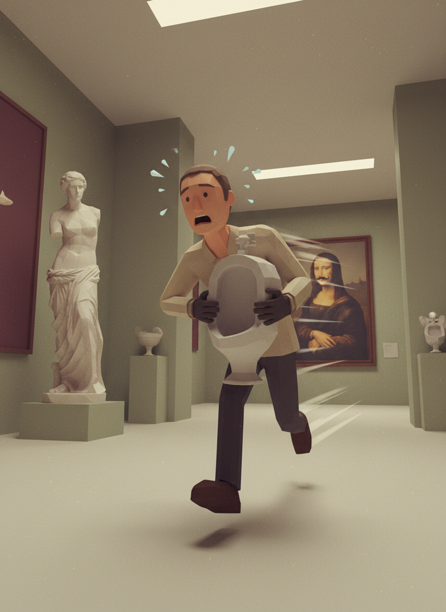
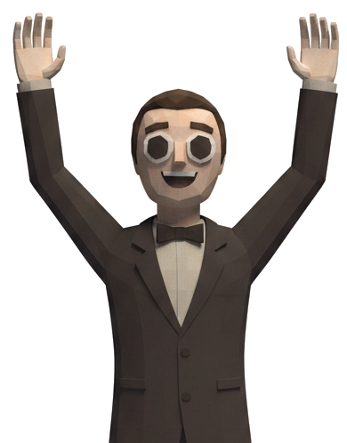
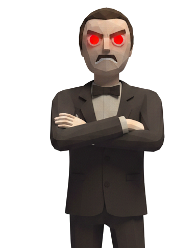

# Exhibit!



Un piccolo gioco in realtà aumentata per Android, fatto con Godot 4.7. Il giocatore ha un tempo limitato per sistemare correttamente le opere di un museo — posizionandole sotto i faretti giusti e mantenendo la giusta distanza tra loro — prima che scada il tempo o che la situazione precipiti.

## Indice

- [Concept](#concept)
- [Come si gioca](#come-si-gioca)
- [Modalità PC vs AR](#modalità-pc-vs-ar)
- [Comandi](#comandi)
- [Schermate](#schermate)
- [Struttura del progetto](#struttura-del-progetto)
- [File esclusi dal repository](#file-esclusi-dal-repository)

## Concept

Il gioco è ispirato al fenomeno studiato in letteratura come **"museum fatigue"**: il calo di attenzione e interesse dei visitatori durante una visita al museo, causato da fattori come il sovraffollamento di oggetti in poco spazio ("object competition"), la disposizione degli ambienti e stimoli distraenti (anche sonori). La barra della fatica del gioco e le sue regole (oggetti troppo vicini, illuminazione corretta, rumori di disturbo) sono una trasposizione ludica di questi concetti.

Riferimenti principali:
- Bitgood, S. (2009). *Museum Fatigue: A Critical Review*. Visitor Studies, 12(2), 93–111.
- Fisher, A. V., Godwin, K. E., & Seltman, H. (2014). *Visual Environment, Attention Allocation, and Learning in Young Children: When Too Much of a Good Thing May Be Bad*. Psychological Science.
- Mukhortova, E. (2025). *Visitor Attention in Museum and Museum Fatigue Syndrome*. Museologica Brunensia, 14(1), 29–37.

## Come si gioca

Il cuore del gioco è la barra della **fatica** (`GameManager.fatica_tot`), che parte al 100% e deve scendere a 0% per vincere. Ecco cosa la fa muovere:

- **Posizionare un'opera sotto un faretto acceso** scala una quota fissa di fatica (100% diviso il numero di opere in scena). La quota si applica una volta sola al momento del posizionamento, solo se l'opera è davvero dentro il cono di luce di un faretto acceso in quell'istante; riprendendo in mano l'opera, la quota viene restituita (la fatica risale).
- **Piazzare due opere troppo vicine tra loro** (sotto ~2 metri) genera un malus che si somma alla fatica, e resta finché non le allontani abbastanza: è un vincolo di spazio voluto, non un bug.
- **Un altoparlante che si rompe** a caso ogni 10-30 secondi inizia a fare rumore. Finché non lo ripari (tenendo premuto vicino per qualche secondo), la fatica non può scendere sotto un certo valore "congelato" nel momento della rottura (minimo 15%, o il valore che aveva già se era più alto) — e mentre è rotto **non puoi raccogliere nuovi oggetti** (posare quello che hai già in mano resta sempre permesso, per non restare bloccato).
- Un **timer** (di default 120 secondi) limita il tempo a disposizione: se scade prima che la fatica arrivi a 0, è sconfitta.

## Modalità PC vs AR

Il gioco gira su due modalità, decise automaticamente all'avvio da `player.gd`:

- **AR (utenti finali)**: passthrough della fotocamera e tracking dello spazio reale. È la modalità pensata per il telefono.
- **PC (solo per test interni)**: quando la modalità AR non è disponibile (es. in editor su desktop), il gioco passa in automatico a un controllo classico da tastiera/mouse. Serve solo per provare le meccaniche senza dover esportare e installare sul telefono ogni volta.

## Comandi

| | PC | AR |
|---|---|---|
| Movimento | WASD | Joystick virtuale touch (basso a sinistra) |
| Guardarsi intorno | Mouse (tasto F per catturare il cursore) | Movimento fisico del telefono |
| Raccogliere/posizionare oggetto | Tasto E | Tasto "Raccogli"/"Posiziona" (appare quando guardi un oggetto interagibile) |
| Riparare speaker rotto | Tieni premuto E guardandolo (~3s) | Stesso principio, mani libere richieste |

## Schermate

Tre schermate di contorno al gioco vero e proprio:

- **Menu principale** — copertina a piena pagina, titolo in stile "poster" e due tasti (Gioca / Esci).
- **Vittoria** — folla e direttore del museo felici.
- **Sconfitta** — folla e direttore arrabbiati, sfondo più cupo.

<p float="left">
  
  
</p>

Entrambe le schermate di fine partita hanno un tasto "Riprova" (ricarica direttamente la partita, senza passare dal menu) e "Esci".

## Struttura del progetto

```
Scene/                      Scene Godot (.tscn)
  main_scene.tscn            La galleria vera e propria
  menu_principale.tscn        Menu principale
  vittoria.tscn / game_over.tscn   Schermate di fine partita
  player.tscn                 Giocatore (PC + AR)
  faretto_fisso.tscn           Faretto con cono di luce rilevabile
  oggetto.tscn / altoparlante.tscn  Opere d'arte e speaker

Scripts/
  Azione/                    Logica lato giocatore/oggetti (player.gd, oggetto.gd, faretto_fisso.gd, virtual_joystick.gd, ...)
  Logica_backend/            Stato di gioco condiviso (game_manager.gd, galleria.gd, menu_principale.gd, vittoria.gd, game_over.gd)

Assets/Immagini/             Immagini usate nell'interfaccia (copertina, direttore, folla, ...)
```

`GameManager` è un **autoload** (singleton): tiene lo stato della partita (fatica, oggetti registrati, speaker rotto, coppie vicine) e va resettato esplicitamente con `GameManager.reset_stato()` prima di ricaricare `main_scene.tscn` (dal menu o da "Riprova"), altrimenti lo stato della partita precedente resterebbe attaccato.

## File esclusi dal repository

Il `.gitignore` esclude di proposito alcune cartelle/file legati alla configurazione locale di sviluppo e all'esportazione Android, non necessari a chi lavora solo sulla logica di gioco.
